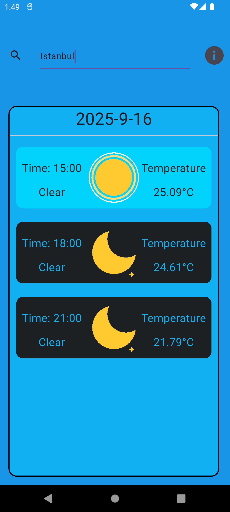
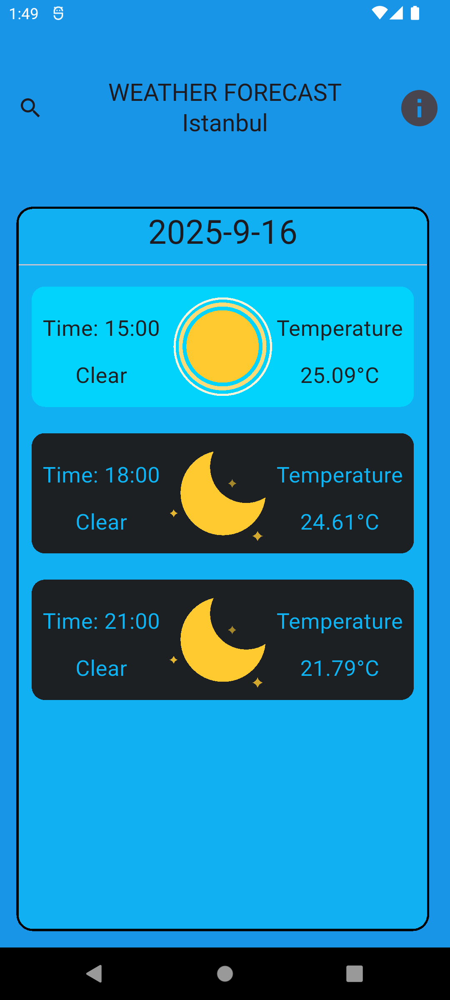
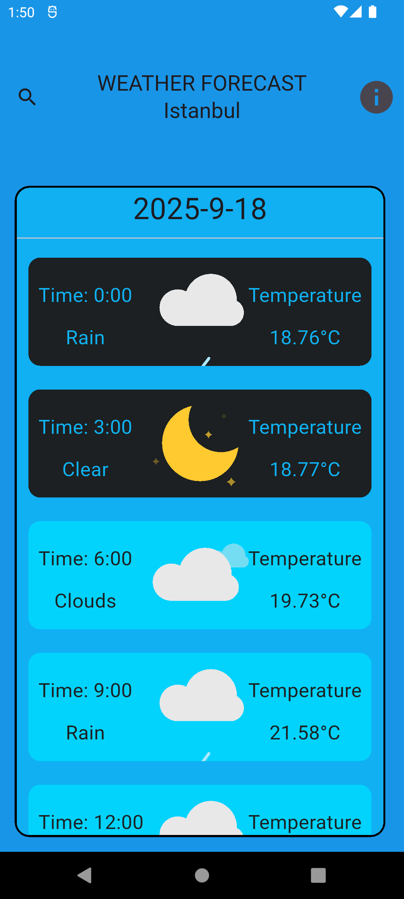
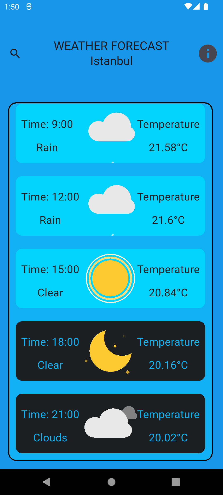

# HAVA DURUMU TAHMİN UYGULAMASI

    5 günlük süreçte tahmini hava durumunu kullanıcıya sunan bir hava durumu uygulaması.

## İÇİNDEKİLER

    - [UYGULAMA HAKKINDA](#uygulama-hakkinda)
    - [UYGULAMA ÖZELLİKLER](#uygulama-özelli̇kleri̇)
    - [UYGULAMA TEKNOLOJİLERİ](#uygulamada-kullanilan-paketler-ve-sürümleri̇)
    - [UYGULAMA İÇİ GÖRSELLER](#uygulama-i̇çi̇-görseller)

# UYGULAMA HAKKINDA
    
    Gelen veriler 3 saat aralıklarla 40 adet veri yapısında gelmektedir. Bu veriler ilgili saatin derecesini,
havanın durumunu(Güneşli, bulutlu, yağmurlu vs.), saat bilgisini gösteren bir yapıdadır.

    Uygulama şuanlık varsayılan olarak ilk açılımda İstanbul şehrinin verilerini göstermektedir fakat uygulama içinden
istenilen zamanda arama kısmından istenilen bir şehir veya ilçenin aramasın yapılarak ilgili bölgenin verileri öğrenilebilir.

    Uygulama kullanım için internet bağlantısı istemektedir, eğer ki internetiniz yoksa ekranda yükleniyor simgesi göreceksiniz.

## UYGULAMA ÖZELLİKLERİ

    Uygulama, http sorgusu ile "https://openweathermap.org/" sitesinden kişisel api ile verileri sağlamaktadır.

    Uygulama restful olup, gelen verilerin yapısı json veri yapısındadır.

    Uygulama içinde ilgili saatin hava durumuna göre gösterilen Lottie dosyaları "https://lottiefiles.com/"
sitesinde alınmıştır ve dosyaların uzantıları .json'dur.

## UYGULAMADA KULLANILAN PAKETLER VE SÜRÜMLERİ

    Uygulama sırasında verileri http sorgusu için çekmek için "flutter http paketi" ve 
Lottie dosyalarını göstermek için "Lottie paketi" kullanılmaktadır.

    *İlgili dosyaların sürümleri*

    Http   : ^1.5.0
    Lottie : ^3.3.2

    Lottie dosyaları için klasör uzantısı : "Assets/"

## UYGULAMA İÇİ GÖRSELLER

    BAZI UYGULAMA İÇİ GÖRSELLER

    

        
        
        
        
    
